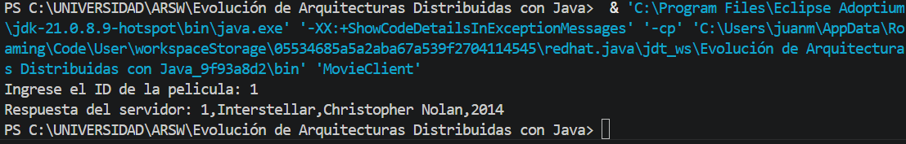
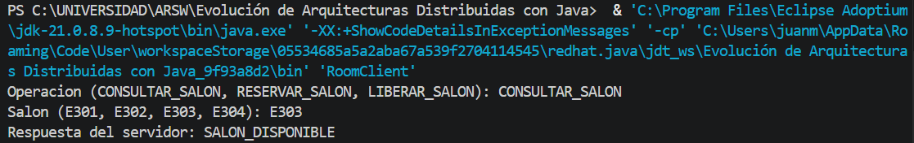
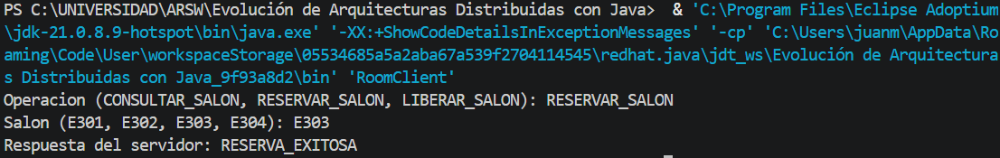
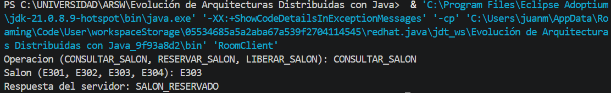
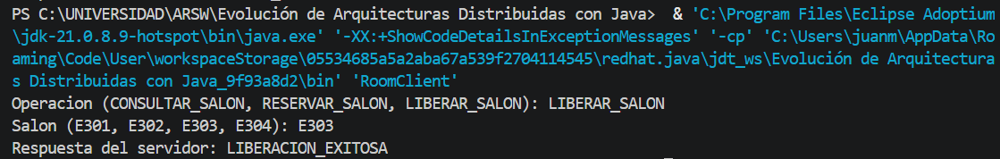
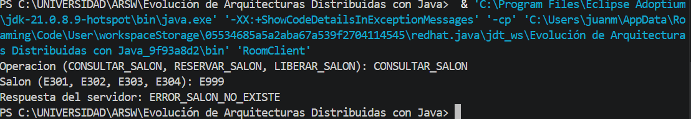

# Parte I - Arquitectura Cliente-Servidor con Sockets TCP

## Diagrama

```text
Cliente Java
   |
   | Mensaje de texto: CONSULTAR_SALON,E303
   v
Servidor TCP Java
   |
   | Respuesta: SALON_DISPONIBLE
   v
Cliente muestra el resultado
```

## Ejemplo guiado: MovieServer TCP

Ubicacion: `movie-tcp`.

Compilar:

```bash
javac *.java
```

Ejecutar servidor:

```bash
java MovieServer
```

Ejecutar cliente en otra terminal:

```bash
java MovieClient
```

Evidencia esperada para el ID `1`:




```text
Respuesta del servidor: 1,Interstellar,Christopher Nolan,2014
```

## Ejercicio aplicado 1: Sistema de Gestion de Salones

Ubicacion: `room-tcp`.

El servidor mantiene en memoria los salones `E301`, `E302`, `E303` y `E304`.
Cada salon esta disponible o reservado.

Protocolo implementado:

```text
CONSULTAR_SALON,E303
RESERVAR_SALON,E303
LIBERAR_SALON,E303
```

Compilar:

```bash
javac *.java
```

Ejecutar servidor:

```bash
java RoomServer
```

Ejecutar cliente:

```bash
java RoomClient CONSULTAR_SALON E303
java RoomClient RESERVAR_SALON E303
java RoomClient LIBERAR_SALON E303
```

Evidencia esperada:

```text
CONSULTAR_SALON,E303 -> SALON_DISPONIBLE
RESERVAR_SALON,E303 -> RESERVA_EXITOSA
CONSULTAR_SALON,E303 -> SALON_RESERVADO
LIBERAR_SALON,E303 -> LIBERACION_EXITOSA
CONSULTAR_SALON,E999 -> ERROR_SALON_NO_EXISTE
OPERACION_INVALIDA,E303 -> ERROR_OPERACION_INVALIDA
```





 
 

 


## Preguntas de reflexion

**Que tan facil seria agregar una nueva operacion al protocolo?**

No es tan facil como agregar un metodo normal. La nueva operacion debe quedar documentada como texto,
el servidor debe reconocerla en el `switch`, el cliente debe construirla exactamente igual y ambos lados
deben acordar la respuesta esperada.

**Que ocurre si dos clientes intentan reservar el mismo salon al mismo tiempo?**

En esta implementacion el servidor atiende una conexion despues de otra. Si se volviera multihilo, la
reserva debe seguir siendo atomica; por eso el repositorio usa metodos `synchronized`. Asi, el primer
cliente que reserve cambia el estado y el segundo recibe `SALON_RESERVADO`.

**Donde esta definido realmente el contrato de comunicacion: en un archivo formal o en convenciones de texto?**

El contrato esta definido en convenciones de texto: nombres como `RESERVAR_SALON,E303` y respuestas
como `RESERVA_EXITOSA`. No existe un archivo formal que genere codigo o valide el contrato.
