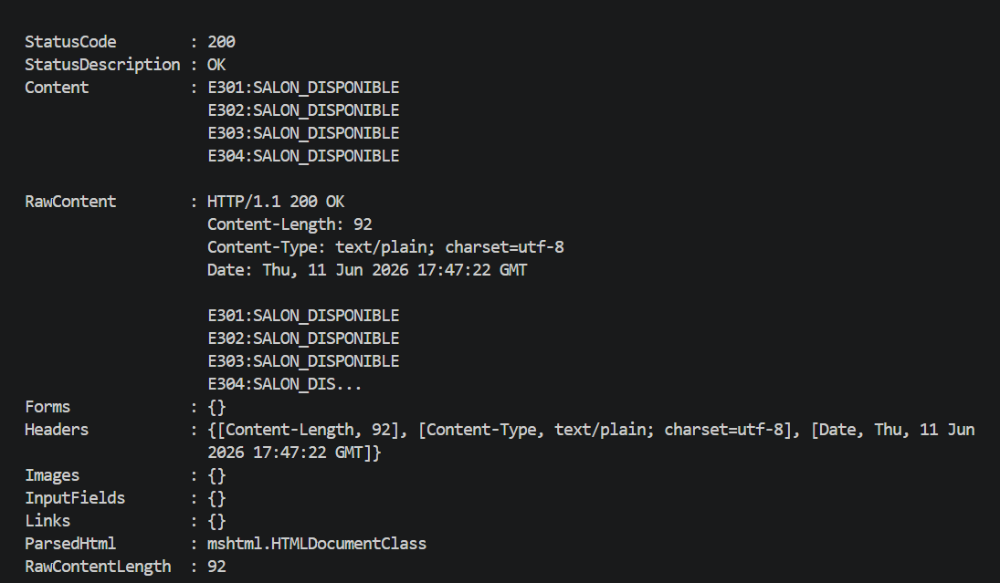
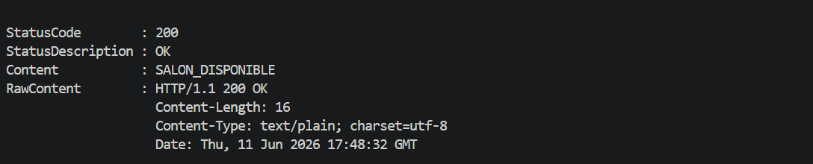
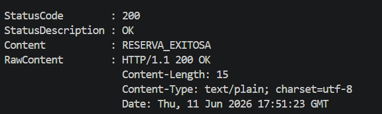
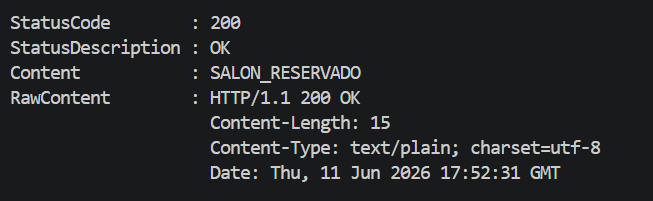
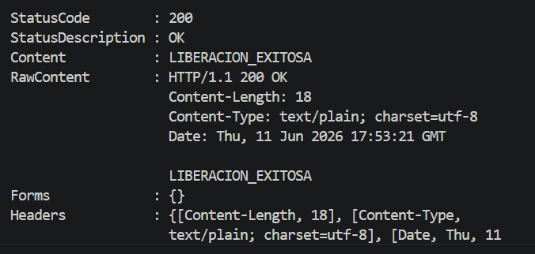

# Parte II - Arquitectura HTTP con Java

## Diagrama

```text
Navegador, curl o Postman
       |
       | GET /rooms?id=E303
       v
Servidor HTTP basico en Java
       |
       | SALON_DISPONIBLE
       v
Cliente visualiza el resultado
```

## Ejemplo guiado: MovieHttpServer

Ubicacion: `movie-http`.

Compilar:

```bash
javac *.java
```

Ejecutar:

```bash
java MovieHttpServer
```

Probar en navegador o con curl:

```bash
curl http://localhost:8080/movie?id=1
```

Evidencia esperada:

```html
<html><body><h1>1,Interstellar,Christopher Nolan,2014</h1></body></html>
```

## Ejercicio aplicado 2: Gestion de Salones via HTTP

Ubicacion: `room-http`.

Rutas implementadas:

```text
GET  /rooms
GET  /rooms?id=E303
POST /rooms/reserve?id=E303
POST /rooms/release?id=E303
```

Compilar:

```bash
javac *.java
```

Ejecutar:

```bash
java RoomHttpServer
```

Probar:

```bash
curl http://localhost:8081/rooms
curl http://localhost:8081/rooms?id=E303
curl -X POST http://localhost:8081/rooms/reserve?id=E303
curl -X POST http://localhost:8081/rooms/release?id=E303
```

En PowerShell, `curl` es un alias de `Invoke-WebRequest`. Use `curl.exe` o el comando nativo:

```powershell
curl.exe http://localhost:8081/rooms
curl.exe "http://localhost:8081/rooms?id=E303"
curl.exe -X POST "http://localhost:8081/rooms/reserve?id=E303"
curl.exe -X POST "http://localhost:8081/rooms/release?id=E303"
```

```powershell
Invoke-WebRequest -Uri "http://localhost:8081/rooms"
Invoke-WebRequest -Uri "http://localhost:8081/rooms?id=E303"
Invoke-WebRequest -Method POST -Uri "http://localhost:8081/rooms/reserve?id=E303"
Invoke-WebRequest -Method POST -Uri "http://localhost:8081/rooms/release?id=E303"
```

Evidencia esperada:


```text
GET /rooms?id=E303 -> SALON_DISPONIBLE
POST /rooms/reserve?id=E303 -> RESERVA_EXITOSA
GET /rooms?id=E303 -> SALON_RESERVADO
POST /rooms/release?id=E303 -> LIBERACION_EXITOSA
GET /rooms?id=E999 -> ERROR_SALON_NO_EXISTE
```

EVIDENCIA 










## Preguntas de reflexion

**Que ventajas ofrece HTTP frente a un protocolo de texto definido manualmente?**

HTTP ya define metodo, ruta, parametros, encabezados y codigo de respuesta. Eso facilita consumir el
servicio desde navegador, curl, Postman u otros lenguajes sin escribir un cliente Java especifico.

**Que limitaciones tiene construir un servidor HTTP sin framework?**

Toda la validacion, el manejo de rutas, errores, formatos y seguridad queda a cargo del programador.
Para sistemas grandes, el codigo crece rapido y se vuelve dificil de mantener.

**Como cambiaria esta solucion si se usara JSON en lugar de HTML?**

La respuesta seria mas facil de procesar automaticamente por clientes. En vez de devolver una pagina
simple, el servidor podria responder objetos como `{"id":"E303","status":"SALON_DISPONIBLE"}`.
